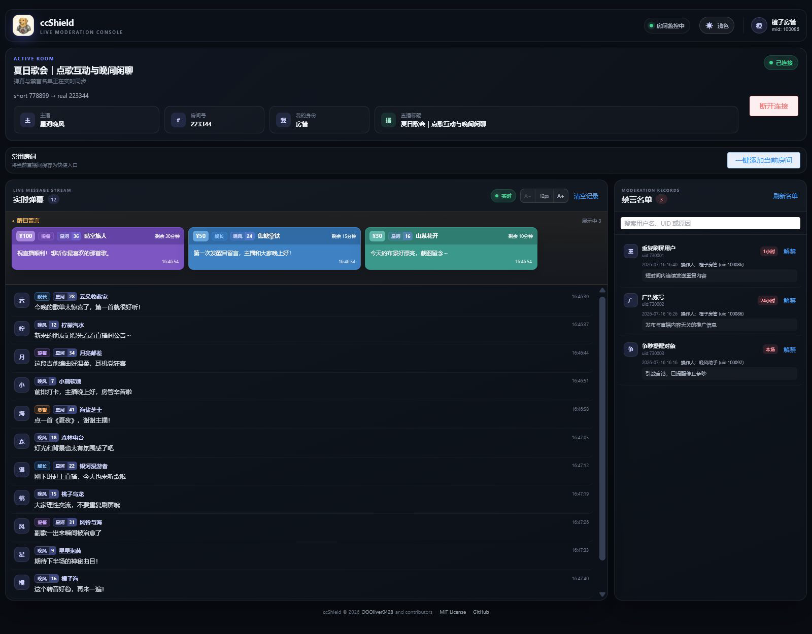

<div align="center">
  
  <h1>ccShield</h1>
  <p><strong>专注弹幕审阅，让直播间管理更从容。</strong></p>
  <p>面向哔哩哔哩直播间管理员的本地实时弹幕与基础房管工作台。</p>
  <p>
    <a href="https://github.com/OOOliver0428/ccShield/actions/workflows/ci.yml"></a>
    <a href="https://github.com/OOOliver0428/ccShield/releases/latest"></a>
    <a href="LICENSE"></a>
    <a href="backend/pyproject.toml"></a>
    <a href="frontend/package.json"></a>
  </p>
</div>



<p align="center"><sub>界面截图使用虚构的主播、用户、弹幕、醒目留言与禁言记录模拟，不包含真实账号或直播间数据。</sub></p>

ccShield 将实时弹幕、醒目留言、直播间信息和禁言名单集中在一个界面中，帮助管理员在高流量直播间保持审阅上下文，并在明确确认后谨慎执行房管操作。

> [!IMPORTANT]
> ccShield 是非官方第三方工具，与哔哩哔哩无隶属或授权关系。使用者应遵守平台规则并自行承担账号和房管操作风险。请勿将 `.env`、Cookie、二维码或个人快捷房间配置分享或提交到仓库。

## 主要功能

- 实时拉取并审阅普通弹幕，缓存上限为 1000 条；进入历史审阅后不被新消息打断。
- 醒目留言固定为单行横向浏览，并按价格从高到低排列。
- 展示舰长、提督、总督等级和粉丝牌等直播间信息。
- 展示主播、房间号、直播标题及当前登录用户在房间中的身份。
- 支持本场、定时和永久禁言；可查询禁言名单并基于名单记录解禁。
- 支持常用房间快捷入口、深浅色主题、电脑版横屏与竖屏布局。
- Cookie 运行中失效时自动停止旧连接、清理工作台并引导重新扫码。

## 项目状态

当前稳定版本为 **v2.1.0**。Windows x64 用户可以直接下载免安装 Release；Linux、macOS 和参与开发的用户继续使用源码启动方式。发行范围与已知限制见 [v2.1.0 规划](docs/plans/v2.1.0.md)。

完整版本记录见 [CHANGELOG.md](CHANGELOG.md)。

## 快速开始

### Windows 免安装版（推荐）

1. 从 [Releases](https://github.com/OOOliver0428/ccShield/releases/latest) 下载 `ccShield-v2.1.0-windows-x64.zip`。
2. 解压到任意目录，双击 `ccShield.exe`。
3. 浏览器自动打开后扫码登录，即可连接直播间。

无需安装 Python、Node.js、Bun 或 uv。Cookie、快捷房间和日志只保存在当前 Windows 用户的 `%LOCALAPPDATA%\ccShield` 目录。当前可执行文件未进行代码签名，Windows 首次运行时可能显示 SmartScreen 提示；请只从本仓库 Releases 页面下载并按同页 `.sha256` 文件校验压缩包。

### 从源码启动

#### 环境要求

- [uv](https://docs.astral.sh/uv/)
- Node.js（自带 npm）或 [Bun](https://bun.sh/)
- Python 3.11 由 uv 自动准备

启动器会同步缺失的依赖，启动后自动打开前端。若默认的 5173 端口被占用，会依次尝试后续可用端口。

#### Windows

双击 `start.cmd`，或在 PowerShell 中运行：

```powershell
.\start.cmd
```

#### Linux

```bash
chmod +x start.sh
./start.sh
```

#### macOS

双击 `start.command`，或在终端中运行：

```bash
chmod +x start.sh start.command
./start.command
```

不希望自动打开浏览器时追加 `--no-browser`；只检查本机环境时追加 `--check`。在启动终端按 `Ctrl+C` 会同时关闭前后端。

源码启动时，首次使用不需要手动填写 Cookie，页面会引导扫码登录。项目读取根目录 `.env`；快捷房间保存在 `config/quick_rooms.json`。两个文件都只属于当前用户并被 Git 和 CI 安全检查排除。Windows Release 则统一保存在 `%LOCALAPPDATA%\ccShield`。

## 使用提示

### 快捷房间

未连接时可打开快捷房间配置，使用短号或正常房间号验证主播、真实房间号和直播标题。连接后也可以一键保存当前房间。初版删除快捷房间需要在关闭 ccShield 后手动编辑配置文件：源码版为 `config/quick_rooms.json`，Release 为 `%LOCALAPPDATA%\ccShield\config\quick_rooms.json`；格式见 `config/quick_rooms.example.json`。

### 弹幕审阅

普通弹幕字号支持 12、14、16、18px 四档并保存在浏览器本地。向上滚动或拖动滚动条会进入历史审阅状态；新弹幕继续缓存但不会改变当前位置，点击“查看最新弹幕”后恢复实时跟随。醒目留言始终保持独立的单行横向区域。

### 登录过期

Cookie 在运行中失效时，ccShield 会停止房间和禁言名单同步、关闭旧 WebSocket、清理工作台并返回扫码页。过期前失败的禁言或解禁不会在重新登录后自动重试，避免重复执行房管操作。

## 文档

| 文档 | 内容 |
| --- | --- |
| [文档索引](docs/README.md) | 全部开发、测试和安全文档 |
| [配置说明](docs/config.md) | `.env`、快捷房间和本地服务配置 |
| [发布指南](docs/release.md) | Windows 成品构建、验证、标签与回滚流程 |
| [测试策略](docs/testing.md) | Mock 边界、覆盖范围和禁止的真实写操作 |
| [安全模型](docs/security.md) | Cookie、LOCAL_TOKEN、回环监听和威胁边界 |
| [API 客户端](docs/api-client.md) | OpenAPI 与 TypeScript 客户端同步流程 |
| [冒烟测试](docs/smoke_test.md) | 安全的成品冒烟与需明确授权的真实操作验证 |

## 参与开发

请阅读 [贡献指南](CONTRIBUTING.md) 和 [社区行为准则](CODE_OF_CONDUCT.md)。Bug 与功能建议请使用仓库提供的 Issue 表单；安全问题请按照 [安全策略](SECURITY.md) 私下报告。

常用检查：

```bash
make lint
make typecheck
make test
```

后端和前端的完整命令、生成文件要求及房管操作测试边界见 [CONTRIBUTING.md](CONTRIBUTING.md)。

## 免责声明

本项目仅用于合法、审慎的直播间管理。维护者不鼓励骚扰、滥用房管权限、规避平台限制或未经授权处理他人账号。B站接口可能随时变化，使用真实房间验证任何写操作前必须明确测试对象、期限和恢复方案。

## 许可证

ccShield 使用 [MIT License](LICENSE) 发布。
